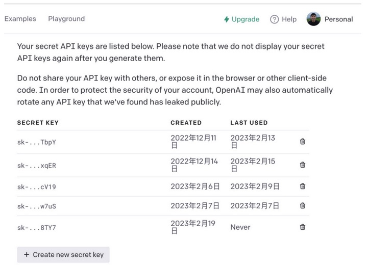
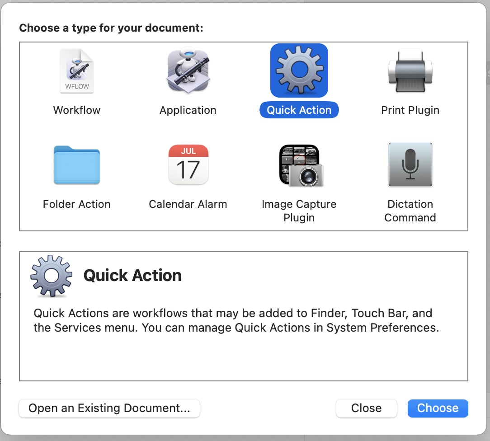
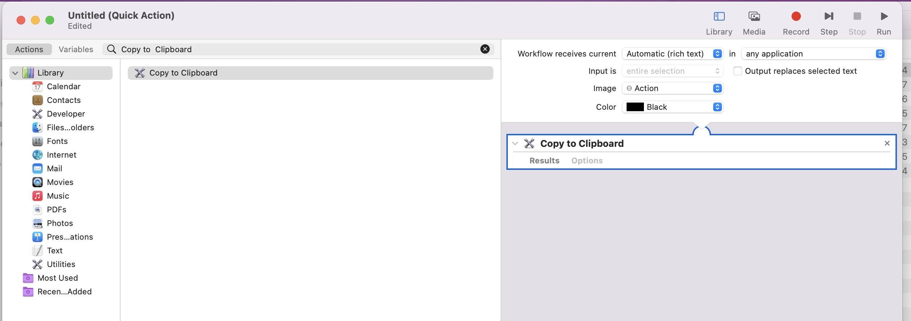
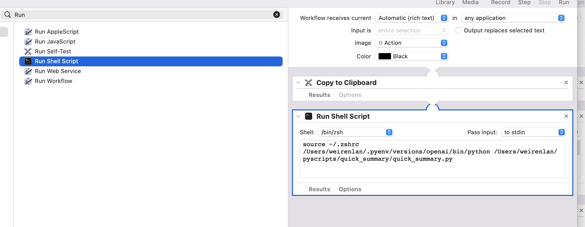
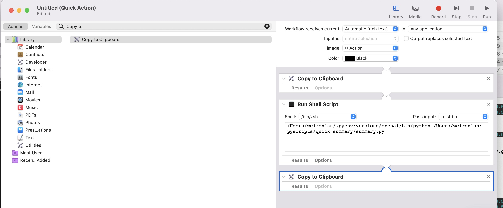
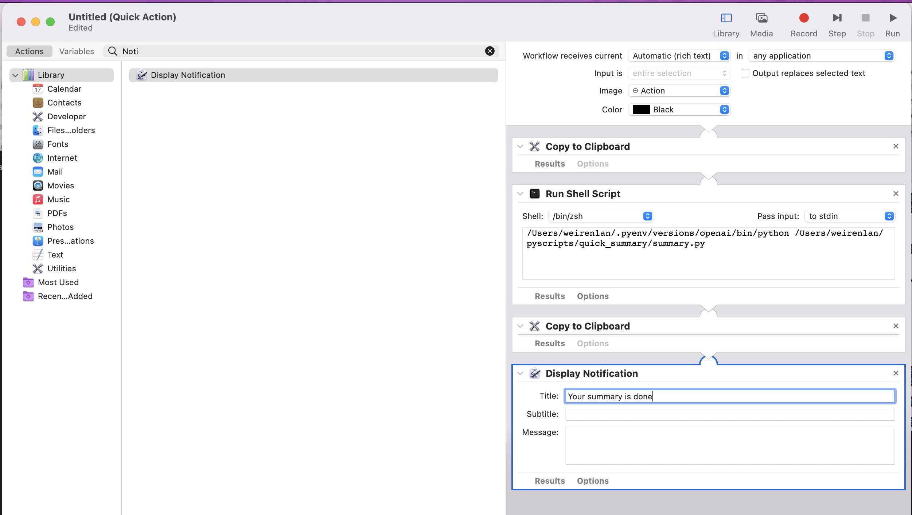

# QuickSummary

## Intro

- Constuct your QuickSummay with OpenAI at Mac Automator QucikAction

## Steps Overview

1. Apply an Open AI API Key and set the key
2. Set the key at your ~/.bashrc or ~/.zshrc
3. Clone this python scripts
4. Install related python packages(pyperclip/openai) at your python environment
5. Constuct QuickAction at Automator

---


1. Apply an Open AI API Key and set the key

   * url: [https://platform.openai.com](https://platform.openai.com)

   
2. Set the key at your ~/.bashrc or ~/.zshrc
   Just append one line to add the key at environment variable

   ```
   export OPENAI_API_KEY="past_your_open_ai_key"
   ```
3. Clone this python scripts

   ```
   $git clone https://github.com/MIBlue119/quick_summary
   ```
4. Install related python packages(pyperclip/openai) at your python environment

   ```
   $pip install pyperclip openai
   ```
5. Constuct QuickAction at Automator

* Seach `Automator` at your lauchpad and open it
  
* Select add new document and Choose **Quick Action**
  
* Build the workflow blocks, search `Copy to Clipboard`
  
* Searh Run Shell Script and drag it to right side too. And source the .zshrc to import your key and run the script with your python
  
* Add the output using clipboard item to receive the results
  
* Add the notification item
  
* Save the workflow and give it a name with command+s
  
